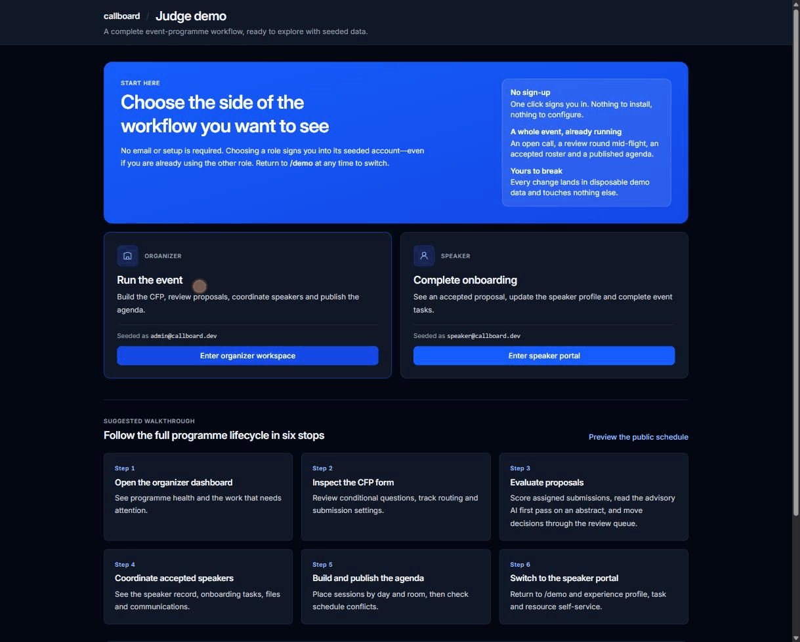

# Callboard

<div align="center">

[](https://github.com/conorbronsdon/callboard-app/stargazers)
[](LICENSE)
[](https://x.com/ConorBronsdon)
[](https://chainofthought.show/?utm_source=github&utm_medium=referral&utm_campaign=repo-readme&utm_content=callboard-app)

</div>


Open-source speaker and call-for-proposals management for events.

Callboard covers the workflow from public submission through organizer review,
speaker onboarding, agenda publishing, communications, and API/integration
exports. It was built for the AI Engineer “Kill My SaaS” challenge as a fast,
self-hostable alternative to Sessionboard.

> A callboard is the physical backstage board where cast calls, schedules, and
> notices are posted—the original speaker-management system.

## Try the demo

**Live demo: <https://demo.callboardhq.com>** · **Project site: <https://callboardhq.com>**

- Event page: <https://demo.callboardhq.com/e/frontier-ai-summit-2026>
- One-click judge roles (organizer and speaker): <https://demo.callboardhq.com/demo>

**Judging this?** [SUBMISSION_EVIDENCE.md](SUBMISSION_EVIDENCE.md) maps every rubric
area to the exact URLs that serve it, with one thing to try on each.



That environment is a disposable, seeded demo. It is periodically reset to the
deterministic seed, so anything created there is temporary and will be wiped,
and it sends no real mail. **Never upload private or sensitive information to
it.**

A self-hosted deployment behaves differently by default: the checked-in
configuration is production-profiled and returns 404 from `/demo`. One-click
organizer and speaker sessions exist only on a disposable demo deployment
created from [`wrangler.demo.example.jsonc`](wrangler.demo.example.jsonc).

Suggested walkthrough:

1. Open `/demo`, choose **Enter organizer workspace**, and follow its six-stop
   judge path.
2. Open **Forms** to inspect conditional questions, shared character budgets,
   routing, close dates, and participant rules.
3. Open **Submissions** to inspect the seven-state decision pipeline and commit
   staged accept/decline queues.
4. Open **Agenda** and move a session on the day board; then inspect the
   dedicated conflict view and published schedule.
5. Return to `/demo`, choose **Enter speaker portal**, then update the profile,
   complete tasks, upload materials, and read event resources.
6. Visit **Integrations**, **API keys**, and `/developers` for exports and the
   Sessionboard-compatible API surface.

## What is implemented

| Area | Current capability |
|---|---|
| Organizer dashboard | Producer-facing programme readiness with explicit blockers and next actions across submissions, speakers, tasks, schedule, rooms, and publication |
| CFP builder | Six-step organizer flow, reusable field registry, conditional logic, cross-field character limits, category/track routing, participant bounds, close dates, limits, and cloning |
| Public submission | Five-step mobile-first SSR flow, drafts, email-verified account entry, abstract/video modes, validation, confirmation email, and portal redirect |
| Submission decisions | Seven status views, staged accept/decline queues, bulk commit, filtering, drill-in, and manual additions |
| Review operations | Standalone assigned-only reviewer workspace, organizer “view as reviewer,” two-round weighted scoring, reviewer aggregates and completion progress, reviewer provisioning by email with an additive capability flag, team management, round/rubric setup (add/remove criterion rows, numeric or dropdown types, lock on first submitted score), per-round blinding, reviewer conflict-of-interest recusal, reviewer reminders, and both batch assignment and direct per-reviewer assignment |
| Score reporting | Aggregate-score sorting in the submissions list, plus a reviewer score CSV export at `/admin/submissions/scores.csv` carrying per-round aggregates and one column per rubric criterion, including dropdown-answer distributions |
| AI first-pass triage | Advisory Workers AI triage on an abstract's detail page: a score, a queue recommendation, and a short rationale carrying the model label. It never writes a review, never changes a submission's status, and degrades to a visible "unavailable in this deployment" when no `AI` binding is present |
| Speaker CRM | Organization-level contact directory spanning every event, with contact profiles, notes, tags, travel notes, CSV import (preview then commit), duplicate detection and merge, add-to-event, bulk email to a filtered selection, rollups for total contacts/events/returning contacts/top companies, savable named filter segments, and a sourcing pipeline (a kanban board over five fixed stages; each card moves either by dragging or by picking a stage and submitting) with a move-audit trail |
| Files library | Organizer-side browser of every upload for an event, grouped into version chains (newest deliverable first), with per-file comments and a bulk ZIP download |
| Multi-event | Multiple events per deployment, an admin event switcher that scopes every organizer screen, and in-app event creation |
| Public & embeddable widgets | Public event page, schedule with search/day tabs/track-format-room facets and clickable speaker names, session detail, speaker directory/profiles/gallery with consent-gated headshots (monogram fallback when a speaker has not opted in), a unified “Show more” control, browser-local “My schedule” itinerary, and an `.ics` feed. An organizer embed builder generates four chrome-less widgets (schedule, agenda by day, speakers, speaker gallery) with theme, density, accent, and track options, emitted as an iframe snippet, a plain link, or a calendar feed. Saved embeds get a stable `?embed=<id>` URL and can be enabled, disabled, or deleted |
| Resource/wiki operations | Event-scoped create/edit/order, sanitized preview, publish/unpublish, and recoverable archive-as-unpublish |
| Speaker portal | Status, deadline-gated pending corrections, accepted title/abstract/video corrections with programme-copy sync, profile, headshot/material uploads, tasks, portal forms, resources, and organizer impersonation |
| Communications | Editable templates, confirmation email, task reminders, communication log, and ICS REQUEST/UPDATE/CANCEL lifecycle |
| Agenda | List/day/week/track/room/conflict views, pointer-correct drag and drop, no-JavaScript fallback, room and speaker overlap detection, an “Auto-place remaining” action that fills unscheduled sessions into conflict-free room/time slots, room and track CRUD, organizer session editing with attributed revision history and one-click restore, publishing that holds until speakers have been informed with an explicit per-session override, and public schedule with ordered speaker/co-speaker names |
| Speaker roster | Add and edit speakers, participation status, portal-invite send, CSV import, and portal-form custom fields from organizer assignment through speaker answers |
| API | Scoped keys, consistent envelopes, sessions/speakers/metadata endpoints, OpenAPI document, and developer page |
| Integrations | Byte-exact Accelevents CSV pair, optional API push when configured, and non-blocking Airtable mirror |
| Infrastructure | One Cloudflare Worker, D1, R2, React Router framework mode, Drizzle, Tailwind, Vitest, and Playwright |

## Limitations

Known open gaps, verified against the commit this file ships in. Each one names the file
or command that shows it, so it can be rechecked rather than taken on trust.

Volatile counts for the commit this file ships in, one reproducing command each: `ls app/db/migrations/*.sql | wc -l` → **17** migrations;
`grep -c 'sqliteTable(' app/db/schema.ts` → **37** tables;
`grep -oE 'insert\("[a-z_]+"' scripts/seed.mjs | sort -u | wc -l` → **29** seeded
tables; `npx vitest list --run | wc -l` → **2610** tests.

**AI triage is advisory only and never decides.** Workers AI (the `"ai"` binding
in `wrangler.jsonc`, model `@cf/meta/llama-3.3-70b-instruct-fp8-fast`) produces a
first-pass score, a queue recommendation, and a short rationale on an abstract's
detail page (`app/lib/review/ai-triage.server.ts`,
`app/components/ai-triage-card.tsx`). It never writes a `reviews` row, never
appears in the reviewer CSV, and never changes a submission's status — the
committee decides. A deployment with no `AI` binding still runs; every triage
surface degrades to a visible “unavailable in this deployment.” The agenda's
“Auto-place remaining” is a separate deterministic conflict-aware planner
(`app/lib/agenda/autoplace.ts`), not a model.

**Submission statuses are a fixed set of seven.** `SESSION_STATUSES` in
`app/db/schema.ts` is a hard-coded list — `draft`, `pending`, `accept_queue`,
`accepted`, `decline_queue`, `declined`, `withdrawn`. Organizers cannot rename,
reorder, or add one; submissions are worked from filtered list views and a
drill-in rather than a status board.

**The CRM sourcing pipeline's stages are fixed.**
The kanban at `/admin/pipeline` lays contacts out in five hard-coded stage
columns (`PIPELINE_STAGES` in `app/db/schema.ts`: `prospect`, `contacted`,
`in_conversation`, `confirmed`, `declined`). A card can be moved by dragging it
between columns or with its stage `select` and **Move** button; both submit the
same audited move action. There is still no stage-management UI to add, rename,
reorder, or remove a stage: the ordering is product workflow, not organizer
configuration.

**The bulk file ZIP is capped at 30 MB.** The Files library at `/admin/files`
lists every upload for an event grouped into version chains with per-file
comments, and `/admin/files/download` streams a selection as a ZIP.
`MAX_ZIP_BYTES` in `app/lib/zip.ts` is `30 * 1024 * 1024`: the archive is
assembled in Worker memory (deliberately not Zip64), so a selection over the cap
is refused with its own size quoted rather than streamed.

**Saved segments are deployment-global and name-keyed.** A Contacts filter
(search, company, title, event, notes, tag) can be saved as a named segment
(`contact_segments` in `app/db/schema.ts`), but the table has no owner column and
a unique index on the name: every organizer on the deployment sees the same
segments, there is no private or per-organizer segment, and saving over an
existing name overwrites it (`save-segment` and `delete-segment` in
`admin.contacts.tsx` are the only actions).

**Contact merge is one-way.** Merging sets `people.merged_into` on the losing
row and re-parents its memberships, tags, notes, and session participations.
There is no unmerge action; the UI says so before you confirm.

**Custom-field tasks provisioned by a later acceptance carry no due date.**
Assigning a portal form writes an absolute due date onto the speakers chosen at
the time, but the reusable template it can also write stores
`dueOffsetDays: null` (`admin.tasks.tsx`), because an absolute date cannot be
turned into the relative offset templates hold. `commit.server.ts` maps that
null straight through to a null `dueAt`, so speakers accepted later get the
questions without a deadline until the organizer sets one on the task.

**Saved embeds cannot be edited in place.** The `save` action always mints a new
`crypto.randomUUID()`, so changing a widget's theme, track, or accent means
saving a second embed and repasting its snippet on the host page. Existing
embeds can be enabled, disabled, or deleted, but not amended.

**Embed track filters are only rename-safe when saved.** Saved embeds store the
track *id* and resolve the name at render, so a saved embed survives a track
rename. Two cases do not: a snippet copied straight from a widget card carries
`?track=<name>` and is matched by name at render
(`app/lib/embeds.server.ts`), and saved rows written before the id-keying change
still hold a name and resolve to themselves. Either one silently becomes an
empty widget on somebody else's page when the track is renamed. Re-save any
embed whose track filter matters after renaming a track.

**The public “My schedule” itinerary is browser-local.** Starred sessions live
in `window.localStorage` in `app/routes/public.schedule.tsx`. It needs
JavaScript, does not sync across devices or browsers, is not tied to an account,
and is lost when site data is cleared. The rest of the public schedule —
search, day tabs, track/format/room facets — works without JavaScript.

**Review blinding hides structured identity, not prose.** A blinded round
excludes a session's `session_participants` row from the reviewer query
entirely — only a `count()` runs (`app/routes/review.index.tsx:114-143`) — so
name, email, company, and title never reach the reviewer. The abstract body is
shown verbatim, so a submitter who names themselves in their own text is still
identifiable, and un-blinding a round does not retroactively hide what a
reviewer already saw before you re-checked the box. The claim is checkable in
the reviewer query itself (`app/routes/review.index.tsx:114-143`): the blinded
branch never selects the identity columns, so they cannot reach the wire.

**The review engine generalizes to awards and grants judging; awards
vocabulary does not exist yet.** Weighted rubrics, enforced per-round
blinding, reviewer recusal, and multi-round assignment are judging primitives,
not CFP-specific ones — nothing in `app/lib/review/` assumes "submission" over
"nominee" or "applicant." Renaming the vocabulary and shipping a public
winners page is deliberate post-competition roadmap, not a gap in what ships
today.

**Reviewer invitations are not delivered.** An outside reviewer can be
provisioned by email and gains the capability immediately (`invite-reviewer` in
`admin.reviews.tsx`), but the invite panel does not claim a delivery it cannot
observe. Team membership is still restricted to reviewer-capable people —
`people.role = "admin"`, an event role in `admin`/`organizer`/`reviewer`, or the
additive `event_people.is_reviewer` flag — so an arbitrary contact cannot be
dropped onto a review team without being provisioned first.

**Revision history is read without a bound.** Organizer session edits and speaker
corrections are versioned in `session_revisions` and restorable, with attribution,
from `/admin/sessions/<id>` (`app/lib/admin/session-revisions.server.ts`). The
history query orders by recency with no `LIMIT`, so a session edited a very large
number of times reads its entire revision list in a single loader pass.

**One D1 database, one region.** `wrangler.jsonc` declares a single `DB` binding
with no read replication configured, so read latency is bounded by the
database's primary region regardless of where the Worker runs.

**Uploads are Worker-proxied and capped at 25 MB.** `MAX_UPLOAD_BYTES` in
`app/lib/portal-uploads.ts` is `25 * 1024 * 1024`. There are no presigned URLs:
every byte in and out passes through the Worker so ownership checks stay on both
paths, which also makes 25 MB a deliberate ceiling rather than a tunable.

**The judge demo sends no real mail.** The demo template pins
`MAIL_DRIVER=console`, so confirmation emails, invitations, reminders, and
decision notifications are printed to the Worker log instead of delivered.
Demo mode reveals the magic link in the sign-in response so a judge can proceed
without a mailbox. Real delivery is a production feature, not a gap: the
Resend driver ships in this repo and native Gmail calendar invites were
verified end-to-end (`app/lib/comms/ics.ts:5`). The judged demo keeps mail on
the console deliberately — an anonymous-writable demo must not be able to
email strangers. Want to see live delivery? Ask, and we'll stand up a
mail-enabled instance scoped to addresses you control. Outlook ICS lifecycle rendering remains unverified.

Submission evidence, including the requirement-to-screen map, is in [SUBMISSION_EVIDENCE.md](SUBMISSION_EVIDENCE.md).

## Verify it yourself

Every row is a claim this README makes, paired with the exact command or URL
that proves or disproves it. Repository commands run from a clean checkout after
`npm ci`. The same rule holds for every figure in this README, not just this
table: each one is either generated from the deployment (a constant named in
its source file, a count with the command that produces it) or paired with the
command that reproduces it.

| Claim | How to check it |
|---|---|
| The migration, table, and seeded-table counts are real | Run the three commands stamped at the top of [Limitations](#limitations); each prints the number quoted beside it |
| The test suite is the size claimed | `npx vitest list --run \| wc -l`. Limitations stamps this count for the commit the file ships in — run it against your checkout and it should match exactly |
| The whole gate passes three consecutive isolated times | `npm run release:verify:repeat` — writes one attempt per pass to `artifacts/release-gate/<sha>/manifest.json` and only sets `"result": "passed"` after three |
| CI runs that same gate, not a lighter one | [`.github/workflows/check.yml`](.github/workflows/check.yml) and [`.github/workflows/repeat-release-gate.yml`](.github/workflows/repeat-release-gate.yml) |
| Calendar invites actually land in a real calendar | `app/lib/comms/ics.ts:5` records the end-to-end verification against Gmail on 2026-08-08: native RSVP card, event auto-staged, conflict detection ran |
| AI triage never decides anything | `grep -nE '\.(insert\|update\|delete)\(' app/lib/review/ai-triage.server.ts` — the only writes target the `ai_triage` table: no `reviews` row, no session status change |
| The deployed demo is up, seeded, and signing in | `npm run smoke:demo -- https://demo.callboardhq.com` |
| The API is real, documented, and machine-readable | <https://demo.callboardhq.com/v1/openapi.json> and <https://demo.callboardhq.com/developers> |
| An agent can orient itself without being told how | `/llms.txt` on any deployment (`app/routes/llms.txt.ts`) — the judge path in order, each brief feature's primary URL, and the API strip, as plain text |
| The public schedule works with JavaScript disabled | Turn JS off and load <https://demo.callboardhq.com/e/frontier-ai-summit-2026/schedule> — search, day tabs, and the track/format/room facets are server-rendered |

### Measured latency

Measured against the live demo on 2026-08-12 from a single US-Pacific client.
One warm-up request per URL is discarded, then seven requests one second apart;
the figure is the **median of the successful responses**:

```sh
curl -s -o /dev/null -w "%{time_total}" https://demo.callboardhq.com/<path>
```

| URL | Median (warm) |
|---|---|
| `/` | 190 ms |
| `/demo` | 86 ms |
| `/admin` (unauthenticated — a 302 to `/login`, not a dashboard render) | 94 ms |
| `/developers` | 224 ms |
| `/e/frontier-ai-summit-2026/schedule` | 390 ms |
| `/e/frontier-ai-summit-2026/schedule/<sessionId>` | 305 ms |
| `/e/frontier-ai-summit-2026/speakers/<personId>` | 305 ms |
| `/v1/openapi.json` | 97 ms |

These are measurements from one client on one evening, not guarantees: they
include network transit, they move by tens of milliseconds run to run, and a
different region will see different numbers.

One thing they surfaced, recorded here rather than left for a judge to hit
cold: under repeated requests the two heaviest public pages intermittently
returned Cloudflare error 1102 (*Worker exceeded resource limits*) — 2 of 7
requests to the schedule and 3 of 7 to a session detail page. Those responses
are excluded from the medians above. Pacing the requests did not remove them, so
this is Worker CPU on the render path, not edge rate limiting.

## Architecture

```
Public CFP / organizer / speaker / API routes
                    │
        React Router framework mode
                    │
       Cloudflare Worker (one deploy)
          ┌─────────┼─────────┐
          │         │         │
        D1 DB      R2 files   Cron jobs
        Drizzle    proxied    reminders/sync
```

Public routes server-render by default and keep client JavaScript small. The
agenda's drag-and-drop layer sits behind a client-only boundary and submits the
same server-rendered form used by the accessible no-JavaScript fallback.

D1 writes use `db.batch()`; D1 does not support Drizzle's interactive
transactions. Uploads are proxied through the Worker so ownership checks remain
on the write and read paths. Secrets are supplied with Wrangler and never stored
in the repository.

## Agents: point your MCP client here

Callboard includes a separate streamable-HTTP MCP Worker. It uses the public
`/v1` API only: no D1, R2, or product bindings, and exactly the access carried
by the event-scoped key you send.

A live instance runs against the demo conference:

```
https://callboard-mcp.conor-afe.workers.dev/mcp
```

Mint a key at [the demo's API keys page](https://demo.callboardhq.com/admin/api-keys)
(one-click organizer sign-in, no signup), then:

```sh
export CALLBOARD_MCP_URL='https://callboard-mcp.conor-afe.workers.dev/mcp'
claude mcp add --transport http --header "x-access-token: $CALLBOARD_KEY" callboard "$CALLBOARD_MCP_URL"
```

`get_openapi` answers without any key, so a client can connect first and
discover the REST API before you mint one.

Or add a project `.mcp.json` without committing the key:

```json
{
  "mcpServers": {
    "callboard": {
      "type": "http",
      "url": "${CALLBOARD_MCP_URL}",
      "headers": { "x-access-token": "${CALLBOARD_KEY}" }
    }
  }
}
```

| Tool | Scope |
|---|---|
| `list_events` | `read:events` |
| `get_schedule` | `read:sessions` |
| `list_submissions` | `read:sessions` |
| `get_submission` | `read:sessions` |
| `search_speakers` | `read:contacts` |
| `list_tracks` | `read:metadata` |
| `capture_abstract` | `write:sessions` |
| `get_openapi` | none |

Mint a least-privilege event key at `/admin/api-keys`. Deployment, connector,
authentication, curl, and complete tool examples are in [docs/MCP.md](docs/MCP.md).

## Local development

Requirements:

- Node.js 22.22 or newer
- npm
- No Cloudflare account for local development

```sh
npm install
cp .dev.vars.example .dev.vars
npm run migrate
npm run seed
npm run dev
```

Open http://localhost:5173. Use `/demo` for seeded one-click sessions, or
`/login` to generate a development magic link.

Seeded accounts:

- `admin@callboard.dev`
- `speaker@callboard.dev`

## Verification

```sh
npm run check          # types + repository guards + Vitest
npm run build          # production Worker/client build
npm run e2e            # seeds first, then Playwright
npm run release:verify # complete local release gate
```

Playwright refuses every non-loopback `CALLBOARD_E2E_URL`. The suite mutates
data and uploads files, and a local process cannot prove that a remote Worker
has disabled real email. Run it only against a disposable local server.

`npm run release:verify` runs the production build, unit/guard/type checks,
migration-drift check, Playwright, a high/critical lockfile dependency audit,
and a guard that rejects mutable GitHub Action references. The same gate is
committed as a GitHub Actions workflow in `.github/workflows/check.yml`.
Generated migrations must be committed.

Both deployed smoke profiles call `/ready`. The probe returns 503 unless
`SESSION_SECRET`, `MAGIC_LINK_SECRET`, and `RATE_LIMIT_SECRET` are present
and the D1 binding exposes the complete `rate_limit_windows` schema. It uses a
zero-row D1 query and does not create sessions, tokens, limiter windows, or demo
data. A passing smoke is repository evidence about those dependencies only; it
is not deployment, walkthrough, or external-secret-scan evidence.

## Commands

| Command | Purpose |
|---|---|
| `npm run dev` | Start the local Vite/workerd server |
| `npm run check` | Typecheck, repository guards, and unit tests |
| `npm run build` | Build the production Worker and client bundles |
| `npm run e2e` | Seed local D1 and run Playwright |
| `npm run release:verify` | Run checks, build, migration drift, and E2E |
| `npm run db:generate` | Generate committed Drizzle migrations |
| `npm run migrate` | Apply local D1 migrations |
| `npm run seed` | Seed the demo event |
| `npm run demo:reset -- --config=wrangler.demo.jsonc` | Dry-run a guarded disposable-demo reset; add `--execute` after review |
| `npm run demo:deploy -- --config=wrangler.demo.jsonc` | Validate and deploy only the repository-root disposable-demo config |
| `npm run preview` | Upload a Cloudflare preview version |
| `npm run deploy` | Check, build, migrate remote D1, deploy, and smoke |
| `npm run smoke:demo -- "$DEMO_URL"` | Verify read-only runtime readiness, seeded judge data, and demo sign-in |
| `npm run smoke:production -- "$APP_URL"` | Verify read-only runtime readiness and prove demo sign-in is disabled |

## Repository layout

```
app/routes/       React Router route modules
app/db/           Drizzle schema, client, and migrations
app/lib/          pure domain logic and server-only adapters
app/components/   shared UI and client-only boundaries
workers/app.ts    Worker fetch and scheduled entry points
scripts/          seed, guards, acceptance checks, and smoke
tests/e2e/        Playwright golden paths and fixtures
```

Some code comments cite private planning and competitive-research notes this
project was built from. Those notes are not part of the public repository; the
conclusions they informed are recorded in [DECISIONS.md](DECISIONS.md).

## About

Callboard is built by [Conor Bronsdon](https://conorbronsdon.com/?utm_source=github&utm_medium=referral&utm_campaign=repo-readme&utm_content=callboard-app) —
host of the [Chain of Thought podcast](https://chainofthought.show/?utm_source=github&utm_medium=referral&utm_campaign=repo-readme&utm_content=callboard-app),
and angel investor in AI infrastructure and developer tools. Say hi on
[X](https://x.com/ConorBronsdon) or
[LinkedIn](https://www.linkedin.com/in/conorbronsdon/).

Before contributing, read [CONTRIBUTING.md](CONTRIBUTING.md). Coding agents must
also read [AGENTS.md](AGENTS.md). Product tradeoffs are recorded in
[DECISIONS.md](DECISIONS.md), and the requirement-to-screen map is in
[SUBMISSION_EVIDENCE.md](SUBMISSION_EVIDENCE.md).

## Deployment

Authenticate Wrangler, create or select D1 and R2 resources, configure
`wrangler.jsonc`, and set secrets:

```sh
npx wrangler login
npx wrangler d1 create callboard-db
npx wrangler r2 bucket create callboard-files
npx wrangler secret put SESSION_SECRET
npx wrangler secret put MAGIC_LINK_SECRET
npx wrangler secret put RATE_LIMIT_SECRET
npx wrangler secret put RESEND_API_KEY
npm run deploy
```

Set `APP_URL` to the deployed origin, `CALLBOARD_URL` to its public
URL, and `CALLBOARD_SMOKE_PROFILE=production`. The checked-in
`wrangler.jsonc` sets `DEPLOYMENT_PROFILE=production` and `DEMO_MODE=0`;
the application also requires both values to opt into demo authentication, so a
stray `DEMO_MODE=1` cannot mint a seeded admin session in production.

### Disposable judge demo

The judge demo is a separate deployment, not an environment toggle on production:

1. Create a dedicated D1 database and R2 bucket. Do not reuse the production
   IDs, names, data, or secrets.
2. Copy `wrangler.demo.example.jsonc` to the gitignored
   `wrangler.demo.jsonc`.
3. Replace every `REPLACE_*` placeholder with the disposable demo origin,
   newly provisioned D1 ID, and an ISO-8601 `DEMO_EXPIRES_AT` no more than seven
   days away. Keep `DEPLOYMENT_PROFILE=demo`, `DEMO_MODE=1`, and
   `MAIL_DRIVER=console`. The one-click route fails closed when the deadline is
   missing, malformed, or passed.
4. Set fresh demo-only `SESSION_SECRET`, `MAGIC_LINK_SECRET`, and
   `RATE_LIMIT_SECRET` values with
   `npx wrangler secret put SECRET_NAME --config wrangler.demo.jsonc` (once per
   secret, substituting each name).
5. Preview the guarded resource targets, then execute the reset:

   ```sh
   npm run demo:reset -- --config=wrangler.demo.jsonc
   npm run demo:reset -- --config=wrangler.demo.jsonc --execute
   ```

   The execute path applies remote migrations first, deletes every R2 object
   recorded in D1 before wiping mutable rows, and restores the deterministic
   seed last. Do not run a separate post-reset migration or seed; the successful
   reset output is the migration-and-seed evidence for the final demo state.

6. Deploy only through the guarded wrapper, then smoke the exact configured
   origin:

   ```sh
   npm run demo:deploy -- --config=wrangler.demo.jsonc
   npm run smoke:demo -- "$DEMO_URL"
   ```

   The wrapper accepts no implicit/default config or extra Wrangler overrides.
   It requires the regular, non-symlink `wrangler.demo.jsonc` at the repository
   root, parses comments and trailing commas consistently, rejects ambiguous
   duplicate safety keys and any Worker/origin/D1/R2 identity shared with the
   default config, reruns the profile/expiry/resource/mail checks, and
   invokes Wrangler with that exact config only after validation. Never use
   `npm run deploy` for the disposable demo: its production predeploy path is
   intentionally tied to the default `wrangler.jsonc` and `callboard-db`.

The reset command refuses the production config, non-disposable resource names,
real email, unresolved placeholders, expired deadlines, and lifetimes over seven
days. Runtime expiry returns 404 from the entire demo Worker; deleting the Worker
and dedicated D1/R2 resources after judging is still an operator-owned Cloudflare
cleanup step. The repository does not provision or edge-rate-limit those
resources, so do not describe a disposable demo as ready until provisioning,
reset output, deployed smoke, access verification, and teardown ownership are
recorded.

## License

[MIT](LICENSE)

## Disclaimer

This is an independent open-source project. It is not affiliated with,
sponsored by, or endorsed by Sessionboard, AI Engineer, Smol AI, Cloudflare,
Resend, Airtable, or Accelevents. Product names are used only to describe
compatibility, research context, or the challenge brief.
